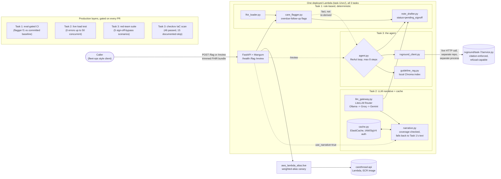

# CareThread

An agentic care-coordination assistant: reviews a patient's record, flags
care-coordination items (an overdue follow-up, a potential drug interaction), and
drafts, never sends unsupervised, a coordination note. Phase 7, the capstone, of a
[30-day production AI/ML engineering roadmap](../30-day-ai-ml-roadmap-industry-portfolio.md),
built entirely against [Floci](https://floci.io) (a local AWS emulator), zero real
patient data anywhere: every patient record is fully synthetic, generated by
[Synthea](https://github.com/synthetichealth/synthea).

## Why fully synthetic data, no shortcuts

Real patient data would make this project subject to HIPAA regardless of how careful
the engineering is. Synthea exists specifically so tools like CareThread can be built
and eval'd with zero real PHI and therefore zero HIPAA obligation, the same reasoning
[RxGround's README](../rxground/README.md#piiphi-and-hipaa-honestly) lays out for why
that project deliberately never touches real patient data either. CareThread Task 3
makes a genuine live HTTP call into a new bonus service in RxGround's own repo
(`rxground/task-7/`) for drug-interaction checks, a real cross-project integration,
both projects share this same non-PHI foundation.

## Tasks

| Task | Folder | What it is |
|---|---|---|
| 1 | [`task-1/`](./task-1) | Eval-gated CI/CD: a rule-based care-coordination flagger over real (trimmed) Synthea FHIR data, a fixed 10-patient golden eval set scored on every PR, a CI gate that blocks a merge on quality regression, and a real deployment reusing FleetPulse Task 9's `lambda-service` Terraform module with a weighted-alias canary |
| 2 | [`task-2/`](./task-2) | Scale: a LiteLLM gateway (Ollama primary, Groq/Gemini fallback) fronting a new optional LLM narrative layer, IAM-authenticated ElastiCache caching, and a load test of the live deployment under a shift-change-style traffic spike. New source lives in `task-1/src/`, not a colliding `task-2/src/`, see task-2's README for why |
| 3 | [`task-3/`](./task-3) | Capstone: a tool-using ReAct agent combining RAG (a local clinical-guidelines index, plus a live HTTP call into a new bonus service in RxGround's own repo for drug-interaction checks) with every production layer built across Tasks 1-2, a red-team suite proving sign-off can't be bypassed, and IaC security scanning (checkov, 46 passed / 0 failed / 15 documented-skip) |

## Architecture

Every request path ends the same way: `status: "pending_signoff"`, forced in code
(`note_drafter.py`'s default, `agent.py`'s unconditional override), never something a
caller or the model can change. See [`task-1/README.md`](./task-1/README.md#architecture)
for the eval-gated flagger and the Floci Lambda-versioning gap the canary work
surfaced, [`task-2/README.md`](./task-2/README.md) for the live multi-provider LLM
failover demo and the load-test findings, and [`task-3/README.md`](./task-3/README.md)
for the full agent architecture, the live RxGround integration, why the agent never
re-derives rule-based flags, and a runbook a stranger can actually follow.

## Tech stack

Click a tool to see what it's used for, and why that one.

<strong>Synthea</strong>, Task 1, generates the only patient data this system ever touches

Zero real PHI anywhere in this repo, in any log, in any cached narrative. A 35-patient
population was generated once, 10 patients trimmed to just the FHIR resource types
the flagger reads (~75MB down to ~6MB) and committed as a fixed, deterministic golden
eval set.

<strong>FastAPI + Pydantic + Mangum</strong>, Task 1 onward, the whole API surface

Same app object, three endpoints added incrementally (`/flag` in Task 1, `/review` in
Task 3), one Lambda deployment throughout. Mangum adapts it to Lambda's Invoke event
shape without rewriting any application code, same pattern FleetPulse Task 9 used.

<strong>Terraform</strong>, Task 1 onward, provisions everything: Lambda, ECR, IAM, ElastiCache

Reuses FleetPulse Task 9's `modules/lambda-service` module unmodified except one
additive `publish` variable, plus a weighted-alias canary resource and (Task 2) an
IAM-authenticated ElastiCache replication group. `checkov` (Task 3) scans it on every
PR, 46 passed / 0 failed / 15 documented `#checkov:skip` exceptions.

<strong>LiteLLM Router</strong>, Task 2, one call surface across three LLM providers

Ollama (local, primary) falling back to Groq then Gemini, verified live: Ollama made
unreachable, Groq genuinely rejected an invalid key, Gemini answered, same response
shape throughout. The same gateway also backs the Task 3 agent's reasoning calls.

<strong>Redis via ElastiCache, IAM/SigV4 auth</strong>, Task 2, caches LLM narratives

Keyed by a hash of the patient's actual flags, not patient ID alone, TTL-bounded. The
IAM auth token is hand-built with `botocore`'s `RequestSigner` (no SDK helper exists
for this the way `rds.generate_db_auth_token` does for RDS), verified against a real
local Redis; Floci's ElastiCache emulation turned out to be control-plane only, see
task-2/README.md for that finding.

<strong>sentence-transformers + Chroma</strong>, Task 3, the local clinical-guidelines RAG index

`BAAI/bge-base-en-v1.5`, same embedding model RxGround's own index uses, for stack
consistency. A similarity gate refuses instead of guessing when nothing relevant is
indexed. Installing `sentence-transformers` naively pulled PyPI's default CUDA-enabled
torch wheel (several GB of GPU libraries a Lambda function can't use); fixed by
installing the CPU-only wheel explicitly first, a real bug found by actually building
the image.

<strong>A hand-rolled ReAct agent</strong>, Task 3, no LangChain/LangGraph

Same text Thought/Action/Observation loop as TutorLoop Task 1's agent, a hard 8-step
limit, two real tools (a live RxGround call, a local RAG lookup). Overdue-follow-up
flagging is never a tool the agent calls, it's rule-based fact handed to it, see
task-3/README.md's "why the agent doesn't re-derive the overdue flags."

<strong>A live HTTP call into RxGround's own repo</strong>, Task 3, the genuine cross-project integration

`rxground/task-7/service.py` is a new bonus FastAPI service in RxGround's repo,
wrapping its existing citation-enforced `answer_question` pipeline unmodified.
Verified live against the real 15-label openFDA index. Falls back to a static
interaction table, not a hallucinated answer or a crash, if RxGround is unreachable.

<strong>checkov</strong>, Task 3, IaC security scanning wired into CI

Same pattern TutorLoop Task 8 established: catch a bad or missing security control in
Terraform before it's ever applied. Found 16 real findings, fixed the one free
correctness win (ElastiCache encryption at rest), documented the other 15 with
`#checkov:skip` reasons directly in the `.tf` files, not a blanket `soft_fail`.

<strong>ruff, pytest, GitHub Actions</strong>, every task, lint and the test suite

Each task's `tests/` runs as its own `pytest` invocation in CI (never combined),
`task-1/src`'s `src`-package naming collides with a second `src` package the moment
two tasks' test suites are imported into one process, the same collision FleetPulse's
`task-2/src/load_data.py` docstring already documents. 56 tests across the three
tasks, a 5-scenario red-team suite among them.

## Repo layout

Own git repo, own virtual environment, own requirements, separate from FleetPulse's,
GridScribe's, RxGround's, and TutorLoop's, same pattern as every other project in this
roadmap. Task 1's Terraform state lives in its own `carethread-tfstate` S3 bucket
(via Floci), never FleetPulse's `fleetpulse-tfstate`, so nothing here can accidentally
touch FleetPulse's live infrastructure.
