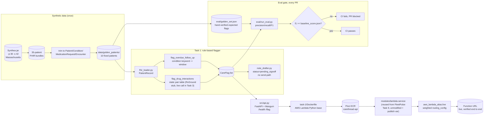

# CareThread Task 1 — Eval-gated CI/CD for CareThread

CareThread is an assistant that reviews a patient's record, flags care-coordination
items (an overdue follow-up, a potential drug interaction), and drafts, never sends
unsupervised, a coordination note. Task 1 builds the skeleton every later CareThread
task sits on: a deterministic, rule-based flagger (the agent arrives in Task 3), a
fixed golden eval set scored on every PR, a CI gate that blocks a merge if the
flagger's accuracy regresses, and a real deployment reusing FleetPulse Task 9's
`lambda-service` Terraform module.

## What was built

- **Synthetic patients.** [`scripts/generate_synthetic_patients.py`](./scripts/generate_synthetic_patients.py)
  documents the exact command used to generate a 35-patient Massachusetts population
  with [Synthea](https://github.com/synthetichealth/synthea) (`-p 30 -s 42 -a 25-85`,
  35 not 30 because Synthea's population count is *alive* patients and this run
  produced 5 additional deceased ones along the way). Real Synthea, the actual MITRE
  Java tool, not a hand-rolled stand-in, run locally via its `synthea-with-dependencies.jar`
  (see that script for why the Docker Hub `synthetichealth/synthea` image wasn't usable,
  it's a years-stale Ruby-era image, not the current Java tool).
- **10 golden patients**, [`data/golden_patients/`](./data/golden_patients), a fixed
  subset of that population, trimmed to just the `Patient`/`Condition`/
  `MedicationRequest`/`Encounter` resources the flagger reads (a full Synthea bundle
  is dominated by `Claim`/`ExplanationOfBenefit` entries the flagger never touches,
  trimming cut the selected set from ~75MB to ~6MB). Fixed, not regenerated per run,
  an eval baseline needs deterministic inputs.
- **`src/fhir_loader.py`** — parses a trimmed FHIR Bundle into a `PatientRecord`
  (conditions, medications, encounters, active-status filtering).
- **`src/care_flagger.py`** — rule-based, two flag types:
  - `overdue_follow_up`: a chronic condition (a small keyword table: diabetes,
    hypertension, heart failure, CKD, COPD, coronary heart disease) with no encounter
    inside its condition-specific window.
  - `drug_interaction`: an active-medication pair matching a small static table
    (warfarin+aspirin, lisinopril+spironolactone, simvastatin+clarithromycin,
    metformin+iodinated contrast). Explicitly labeled a **stub** in its `source`
    field, standing in for what CareThread Task 3 replaces with a live retrieval
    call into RxGround's drug-interaction index, see "Why the drug-interaction check
    is a stub, not a live RxGround call" below.
- **`src/note_drafter.py`** — turns flags into a `CoordinationNoteDraft`,
  `status="pending_signoff"` always, no send-path exists anywhere in this module.
- **`src/api.py`** — thin FastAPI service (`/health`, `/flag`), Mangum-wrapped for
  Lambda, the real deploy target below.
- **`eval/`** — `golden_set.json` (hand-verified expected flags per patient, 11 total
  flags across the 10 patients: 10 overdue, 1 interaction), `run_eval.py`
  (exact-match precision/recall/F1 over `(patient_id, flag_type, detail)` triples),
  `baseline_score.json` (committed `f1: 1.0`). `run_eval.py` exits nonzero when the
  live score drops below the committed baseline, that's the actual gate.
- **`terraform/`** — FleetPulse Task 9's `modules/lambda-service` copied in unmodified
  except one additive, backward-compatible variable (`publish`, default `false`), plus
  root config (`main.tf`) that calls it with CareThread's own function name, image, and
  env vars, and a weighted-alias resource for canary deploys. See "Deploying" and
  "The canary and a real Floci gap" below.
- **`.github/workflows/ci.yml`** (repo root) — lint, unit tests, the eval gate, a
  Docker build check, and a `terraform validate` job on every PR.

## Architecture



## Why the drug-interaction check is a stub, not a live RxGround call

The roadmap describes CareThread's drug-interaction flag as "calling RxGround," and
that live cross-project integration is explicitly CareThread **Task 3**'s job ("a live
call into RxGround for drug-interaction checks, a genuine cross-project integration").
Wiring it into Task 1 would couple this task's eval determinism to RxGround's index
build state and network availability, exactly what a CI-run eval gate can't depend on,
`run_eval.py` needs to produce the same score on every run for the baseline comparison
to mean anything. `KNOWN_INTERACTIONS` in `care_flagger.py` is a small, honestly-labeled
placeholder (`source="stub:known_interactions (RxGround call arrives Task 3)"`)
covering exactly the interaction pair the golden set exercises.

## Why the golden set is 10 real (trimmed) Synthea patients, not hand-written fixtures

Two options existed: hand-write a dozen synthetic-looking patient records, or run
real Synthea and select real output. Real Synthea output was chosen because it's what
the roadmap actually specifies, and because Synthea's generated data has genuine
messiness (multi-year condition histories, medications spanning both `active` and
`stopped` status, `DECEASED` patients) that a hand-written fixture wouldn't naturally
produce, precisely the kind of messiness a rule-based flagger needs to be tested
against. Of the 35 generated patients, 28 produced zero flags, 6 produced only
`overdue_follow_up`, and 1 produced only `drug_interaction`. The 10 selected split
4 clean / 5 overdue-only / 1 interaction-only, favoring flagged cases over the
population's natural ~80% clean rate so the eval set actually exercises both flag
types, a golden set that was 80% clean patients would pass trivially even with a
badly broken flagger.

## Deploying

```bash
eval $(floci env)
aws s3 mb s3://carethread-tfstate   # once, backend.tf does not create its own bucket

docker build -f task-1/Dockerfile -t carethread-api-lambda:v1 .
aws ecr create-repository --repository-name carethread-api 2>/dev/null || true
REPO_URI=$(aws ecr describe-repositories --repository-names carethread-api --query 'repositories[0].repositoryUri' --output text)
aws ecr get-login-password | docker login --username AWS --password-stdin "${REPO_URI%%/*}"
docker tag carethread-api-lambda:v1 "$REPO_URI:v1"
docker push "$REPO_URI:v1"

cd task-1/terraform
terraform init
terraform apply -var="image_tag=v1"
```

Verified end to end against the live Function URL:

```
$ curl http://<function-url>/health
{"status":"ok"}

$ curl -X POST http://<function-url>/flag -d '{"bundle": <trimmed FHIR bundle>, "as_of": "2026-08-15"}'
{"patient_id": "...", "flags": [{"flag_type": "overdue_follow_up", ...}], "note": {"status": "pending_signoff", ...}}
```

## Reusing FleetPulse Task 9's module, and the one gap that reuse surfaced

`terraform/modules/lambda-service/{main,variables,outputs,versions}.tf` are FleetPulse
Task 9's files, copied in unmodified with one additive change: a `publish` variable
(default `false`, so FleetPulse's own usage is untouched) and two new outputs
(`version`, `qualified_arn`), needed so `main.tf` can create a weighted-alias canary
(`aws_lambda_alias.live`, `routing_config.additional_version_weights`), Lambda's own
free, built-in canary mechanism, no CodeDeploy setup required.

Applying it surfaced a real Floci fidelity gap: with `publish = true` set, real AWS
Lambda would create a new numbered version (`1`, `2`, ...) on every apply with changed
code. Floci's Lambda emulation doesn't, `aws lambda list-versions-by-function` after
`publish = true` still shows only `$LATEST`. The mechanism itself is correct, and would
produce real weighted canary traffic splitting against real AWS, only the emulator's
versioning support is missing, the same shape of gap as Task 9's SSM parameter ARNs
returning null (see that README's note), a Floci limitation to design around, not a bug
in this module.

## Done when

- The eval gate genuinely blocks a regression, verified by breaking it on purpose:
  deleting the `"heart failure": 90,` line from `FOLLOW_UP_WINDOWS_DAYS` in
  `care_flagger.py` (silently dropping a follow-up rule, the kind of change a real PR
  might make without noticing its blast radius) and re-running the gate locally:
  ```
  $ python task-1/eval/run_eval.py
  ...
  FAIL: f1=0.9 is below baseline f1=1.0 (quality-gate regression, PR blocked).
  ```
  The same check runs as CI's `Eval gate` step on every PR, so this exact regression
  would fail the PR, not just a local run.
- The exact module being reused is
  [`terraform/modules/lambda-service`](./terraform/modules/lambda-service), copied
  from [`fleetpulse/task-9/terraform/modules/lambda-service`](../../fleetpulse/task-9/terraform/modules/lambda-service).
- `carethread-api`'s Function URL is live against Floci and returns real flags and a
  `pending_signoff` draft note for a real trimmed-FHIR patient bundle.
