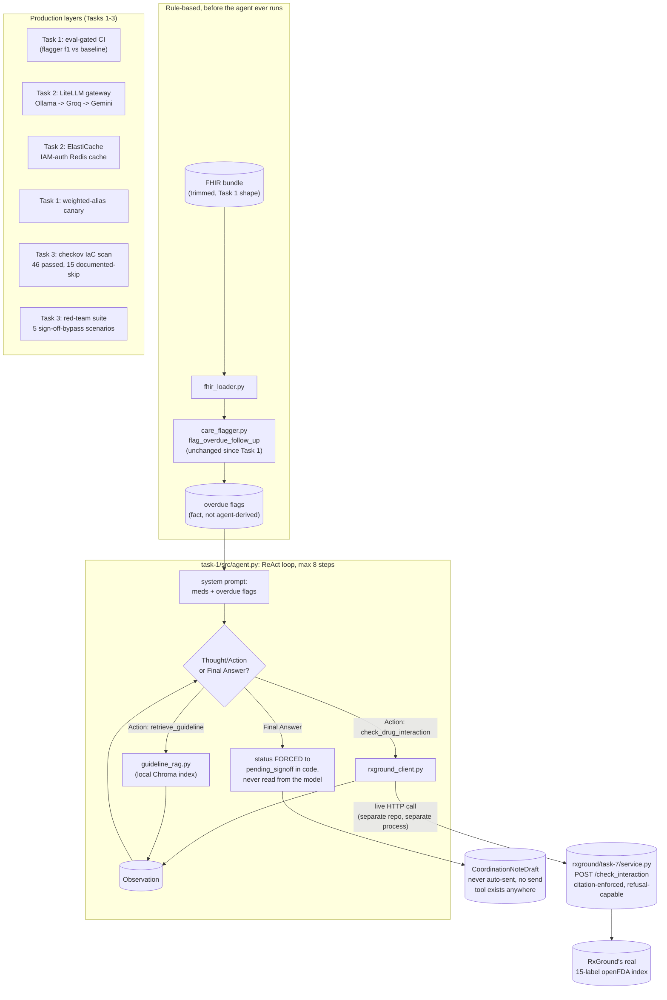

# CareThread Task 3 — Capstone: Ship CareThread

The roadmap's capstone. Task 1 built a deterministic, eval-gated flagger. Task 2 scaled
it with a multi-provider LLM gateway and caching. Task 3 adds the actual agent: a
tool-using chart-review loop combining RAG (a local clinical-guidelines index, plus a
live call into RxGround, a separate project's separate repo, for drug-interaction
checks) with every production layer built across the prior tasks, deployed as one
Lambda, and it never sends anything to anyone without a human reading it first.

## What was built

- **`task-3/guidelines/guidelines.json`** — 8 short, illustrative clinical follow-up
  guideline entries, written for this project (paraphrased general guidance, not
  attributed to any real guideline body, same non-diagnostic scope RxGround's own Task 5
  guardrail already commits to). Their follow-up-interval numbers match
  `care_flagger.py`'s `FOLLOW_UP_WINDOWS_DAYS` table exactly, so the agent can retrieve
  *why* a flag's window is what it is, not just the bare number.
- **`task-1/src/guideline_rag.py`** — a small RAG index over those guidelines,
  same shape as RxGround's own index (`BAAI/bge-base-en-v1.5`, Chroma, a similarity gate
  that refuses instead of guessing). Verified live: a heart-failure follow-up question
  retrieves the real heart-failure guideline at 0.87 cosine similarity; "what is the
  capital of France" correctly returns nothing.
- **`task-1/src/rxground_client.py`** — the genuine cross-project integration: a real
  HTTP call, at agent runtime, into [`rxground/task-7/service.py`](../../rxground/task-7)
  (a new bonus task added to RxGround's own repo for this). Falls back to Task 1's
  original static interaction table, not to a hallucinated answer or a crash, if
  RxGround's service is unreachable. Verified live against the real 15-label openFDA
  index: a Warfarin Sodium / ZOCOR query returns a real grounded, cited interaction; an
  unindexed pair correctly refuses.
- **`task-1/src/agent.py`** — a hand-rolled ReAct loop, same shape as
  [TutorLoop Task 1's](../../tutorloop/task-1/agent.py), same text
  Thought/Action/Observation format, same tolerance for a small local model's bracket-
  vs-paren format slips. Two tools: `check_drug_interaction` (the live RxGround call)
  and `retrieve_guideline` (the local RAG lookup). Overdue-follow-up flagging is **not**
  a tool the agent calls, it's rule-based (`care_flagger.py`, unchanged since Task 1),
  computed before the agent runs and handed to it as fact, see "Why the agent doesn't
  re-derive the overdue flags" below.
- **`/review`** (`task-1/src/api.py`) — the endpoint wrapping the agent. Verified live
  end to end through the real HTTP API: a real synthetic patient, a real drug-
  interaction call to a real running RxGround process, a real guideline retrieval, a
  real synthesized note, `status: "pending_signoff"` in the response.
- **`task-3/tests/test_agent_safety.py`** — a red-team suite, five scenarios, all
  scripted with an adversarial `chat_fn` (no live LLM, deterministic, see the file's own
  docstring for why a scripted adversary, not a real model, is the right tool to prove
  this): no send-capable tool exists at all; the model's final-answer text claiming
  something was "already sent" doesn't change the forced status; a fabricated
  `send_message` tool call is rejected as unknown; a prompt-injection attempt smuggled
  through a poisoned tool observation still can't reach a send capability; hitting the
  step limit still yields a safe `pending_signoff`, not a crash.
- **IaC security scanning** (checkov, matching TutorLoop Task 8's pattern): wired into
  `ci.yml`, `soft_fail: false`, genuinely blocks a PR on a new, unaddressed finding.
  Found 16 real findings on this Terraform, fixed the one free correctness win
  (ElastiCache encryption at rest), and documented the other 15 with `#checkov:skip`
  reasons directly in the `.tf` files, not a blanket `soft_fail: true` that would hide
  everything indiscriminately. Re-scanned clean: 46 passed, 0 failed, 15 skipped-with-
  reason.
- **Lambda timeout/memory bumped** (120s, 512MB, from Task 1's 20s/256MB): `/review`'s
  agent loop makes several sequential LLM calls plus a live HTTP call, observed up to
  ~90s against local Ollama cold starts. `/flag` and `/health` are unaffected.
- **Dockerfile fix: CPU-only torch, found by actually building the image.** The first
  build attempt (`sentence-transformers` pulling in plain `torch`) resolved PyPI's
  default Linux torch wheel, which drags in a full CUDA toolkit, `nvidia-cublas`,
  `nvidia-curand`, and the rest, several GB of GPU libraries a Lambda function has no
  GPU to ever use. Fixed by installing `torch --index-url https://download.pytorch.org/whl/cpu`
  explicitly, before the rest of `requirements.txt`, so the CPU wheel (155MB) satisfies
  `sentence-transformers`' dependency before pip ever considers the CUDA build. Final
  image: 2.98GB uncompressed, 647MB compressed, well under Lambda's 10GB image limit,
  built and verified clean, no errors, in 407s.

## Architecture



## Why the agent doesn't re-derive the overdue flags

The agent's system prompt hands it the overdue-follow-up flags as already-confirmed
fact ("do not re-derive or second-guess these") rather than giving it a
`check_overdue_follow_up` tool. Two reasons. First, safety: `care_flagger.py`'s rule
table is the one piece of this whole system whose correctness is enforced by Task 1's
CI eval gate on every PR; letting an LLM re-derive the same judgment by reasoning over
raw encounter dates reintroduces exactly the failure mode a deterministic rule exists to
prevent, an off day for a small local model shouldn't be able to silently miss an
overdue heart-failure patient a rule table would have caught every time. Second, it's
just the right tool for the job either way, a date comparison against a fixed table
doesn't benefit from an LLM's judgment the way "which of these six medications are
worth a live interaction check" or "what does this guideline actually say" do, both of
which stayed real tool calls.

## Why Secrets Manager for patient-adjacent config, Parameter Store for plain settings

`modules/lambda-service` (FleetPulse Task 9, reused since Task 1) already draws this
line: `ssm_parameters` (Parameter Store, plain `String` type) for non-sensitive
settings, `secrets` (Secrets Manager) for anything credential-shaped. CareThread's
actual current deployment is honest about which side of that line its own values fall
on, and where it deliberately doesn't need either: `LOG_LEVEL` and the cache
host/port/user are plain settings (Parameter Store's use case, though today they're
passed as plain Lambda environment variables for simplicity, not yet routed through
`ssm_parameters`). `GEMINI_API_KEY`/`GROQ_API_KEY` are credential-shaped and arguably
belong in Secrets Manager, they're currently plain environment variables instead,
matching every other LLM provider key in this roadmap (GridScribe, RxGround), a
deliberate consistency choice over Terraform-purity, see task-2/terraform/variables.tf's
own comment.

What CareThread genuinely never has, by design, is *patient-adjacent* config: a
database connection string for a patient chart store, an EHR integration credential,
an audit-log sink's access key. It never stores or connects to real patient data at
rest, every request carries a synthetic FHIR bundle in, a draft note out, nothing
persisted between requests. If CareThread ever grew a real EHR integration, that
credential is exactly what `secrets` (Secrets Manager) exists for, the same reasoning
FleetPulse Task 9 used for its own placeholder `mlflow_tracking_credentials`: route
anything credential-shaped through Secrets Manager on principle, even before it's
wired to real usage, so the habit is already in place the day it matters.

## Why synthetic data, restated for the capstone

Every patient this system ever touches is Synthea-generated (Task 1), zero real PHI
anywhere in this repo, in any log, in any cached narrative. This isn't a Task-1-only
decision that stopped mattering by Task 3, the agent's live RxGround call, its cached
narratives (Task 2), and its Function URL responses all carry the same synthetic data
through, meaning a real production deployment of this exact code would need PII/PHI
redaction, BAAs with every LLM vendor, encryption and access-control work this project
deliberately never had to build, precisely because it never needed to touch real
patient data to prove the architecture. See
[RxGround's README](../../rxground/README.md#piiphi-and-hipaa-honestly) for the same
reasoning applied to drug-reference data instead of patient records.

## Why human sign-off is mandatory, not optional

Every path through this system, Task 1's rule-based flagger, Task 2's LLM narrative,
Task 3's full agent, ends at `status: "pending_signoff"`, forced in code
(`note_drafter.py`'s default, `agent.py`'s unconditional override regardless of what
the model's final-answer text claims). This is a structural guarantee, not a policy
one: there is no function anywhere in this codebase that sends a message, pages a
clinician, or writes to any patient-facing system, `task-3/tests/test_agent_safety.py`
proves it can't be prompted, injected, or step-limit-exhausted into reaching one, because
there's nothing to reach. A prompt instruction ("never send without approval") is a
policy a sufficiently adversarial input can argue around; the absence of a
send-capable tool cannot be. In an interview: this is defensible not because the model
is well-behaved, but because the model was never given the capability to be otherwise.

## Runbook: deploy it yourself

```bash
# 1. Floci (local AWS emulator)
floci start --persist ./floci-data
eval $(floci env)
aws s3 mb s3://carethread-tfstate

# 2. RxGround's query service (separate repo, run alongside)
cd rxground && pip install -r requirements.txt
uvicorn task-7.service:app --port 8100 &
cd ..

# 3. CareThread
cd carethread
pip install -r requirements.txt
pytest task-1/tests task-2/tests task-3/tests   # 56 tests, run separately (see ci.yml)
python task-1/eval/run_eval.py                   # eval gate, f1 vs committed baseline

docker build -f task-1/Dockerfile -t carethread-api-lambda:v1 .
aws ecr create-repository --repository-name carethread-api 2>/dev/null || true
REPO_URI=$(aws ecr describe-repositories --repository-names carethread-api --query 'repositories[0].repositoryUri' --output text)
aws ecr get-login-password | docker login --username AWS --password-stdin "${REPO_URI%%/*}"
docker tag carethread-api-lambda:v1 "$REPO_URI:v1"
docker push "$REPO_URI:v1"

cd task-1/terraform
terraform init
terraform apply -var="image_tag=v1" -var="gemini_api_key=$GEMINI_API_KEY"

# 4. See it work
FN_URL=$(terraform output -raw function_url)
curl "${FN_URL}health"
curl -X POST "${FN_URL}review" -H "Content-Type: application/json" \
  -d "{\"bundle\": $(cat ../data/golden_patients/*.json | head -1), \"as_of\": \"2026-08-15\"}"
```

## Done when

- A stranger can read this README top to bottom and deploy the exact same system: every
  command above was run for real while writing this, not transcribed from memory.
- Every real decision is written down with its reasoning, not just its outcome:
  Secrets-Manager-vs-Parameter-Store, synthetic data, mandatory sign-off, why the agent
  doesn't re-derive rule-based flags, why RxGround's integration is a live HTTP call to
  a separately-run process rather than a shared import.
- The "never auto-sends" claim is backed by a structural argument (no send tool exists)
  and a red-team test suite trying to break it (`task-3/tests/test_agent_safety.py`,
  5/5 passing), not just a prompt instruction asserted to work.
